# AIS-Practica-3-2024

Nombre de los alumnos: Jorge Leal y Javier Laureano Ochoa

### Función comparativa
```java
public void funcionComparativa (String salida, String ronda) {
    PiratesURJC partida = new PiratesURJC();
    String resultado = partida.play(ronda);
    assertEquals(salida, resultado);
}
```
Descripción: 

### R1_1

**INPUT y OUTPUT**: "1M 4M" -> "Gana jugador 2"

**R1_1. Código de test**
```java
@Test
@DisplayName("Test R1_1 (1M 4M)")
public void TestR1_1 (){
    funcionComparativa("Gana jugador 2", "1M 4M");
}
```

**R1_1. Mensaje del test añadido que NO PASA**

```log
org.opentest4j.AssertionFailedError: 
Expected :Gana jugador 2
Actual  :null
```

**R1_1. Código mínimo para que el test pase**

```java
public String play(String ronda){
    return "Gana jugador 2";
}
```
Descripción: Como no hay requisitos, simplemente necesitamos un return con la salida deseada

**R1_1. Captura de que TODOS los test PASAN**


### R1_2

**INPUT y OUTPUT**: "5M 2M" -> "Gana jugador 1"

**R1_2. Código de test**
```java
@Test
@DisplayName("Test R1_2 (5M 2M)")
public void TestR1_2 (){
    funcionComparativa("Gana jugador 1", "5M 2M");
}
```

**R1_2. Mensaje del test añadido que NO PASA**

```log
org.opentest4j.AssertionFailedError: 
Expected :Gana jugador 1
Actual   :Gana jugador 2
```

**R1_2. Código mínimo para que el test pase**

```java
public String play(String ronda){
    if (ronda.equals("5M 2M"))
        return "Gana jugador 1";
    return "Gana jugador 2";
}
```
Descripción: Ahora disponemos de dos salidas en base a entradas diferentes, por lo que con un if y una condición gestionamos la salida

**R1_2. Captura de que TODOS los test PASAN**


### R1_3

**INPUT y OUTPUT**: "1M 2M 4M" -> "Gana jugador 3"

**R1_3. Código de test**
```java
@Test
@DisplayName("Test R1_3 (1M 2M 4M)")
public void TestR1_3 (){
    funcionComparativa("Gana jugador 3", "1M 2M 4M");
}
```

**R1_3. Mensaje del test añadido que NO PASA**

```log
org.opentest4j.AssertionFailedError: 
Expected :Gana jugador 3
Actual   :Gana jugador 2
```

**R1_3. Código mínimo para que el test pase**

```java
public String play(String ronda){
    if (ronda.equals("5M 2M"))
        return "Gana jugador 1";
    else if (ronda.equals("1M 2M 4M"))
        return "Gana jugador 3";
    return "Gana jugador 2";
}
```
Descripción: Ahora disponemos de tres salidas en base a entradas diferentes, por lo que con dos if y dos condiciones gestionamos la salida

**R1_3. Captura de que TODOS los test PASAN**

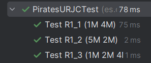

### R1_4

**INPUT y OUTPUT**: "5M 2M 4M 7M" -> "Gana jugador 4"

**R1_4. Código de test**
```java
@Test
@DisplayName("Test R1_4 (5M 2M 4M 7M)")
public void TestR1_4 (){
    funcionComparativa("Gana jugador 4", "5M 2M 4M 7M");
}
```

**R1_4. Mensaje del test añadido que NO PASA**

```log
org.opentest4j.AssertionFailedError: 
Expected :Gana jugador 4
Actual   :Gana jugador 2
```

**R1_4. Código mínimo para que el test pase**

```java
public String play(String ronda){
    if (ronda.equals("5M 2M"))
        return "Gana jugador 1";
    else if (ronda.equals("1M 2M 4M"))
        return "Gana jugador 3";
    else if (ronda.equals("5M 2M 4M 7M"))
        return "Gana jugador 4";
    return "Gana jugador 2";
}
```
Descripción: Ahora disponemos de cuatro salidas en base a entradas diferentes, por lo que con tres if y tres condiciones gestionamos la salida

**R1_4. Captura de que TODOS los test PASAN**


**R1_4. Refactorización**

Justificación: Al analizar los ejemplos podemos observar que cuando la letra es la misma en todas las entradas,
el ganador es el que tenga el número más alto. Por lo que almacenamos la letra y el número del primer jugador y comparamos 
este último con el del resto de jugadores para almacenar el número mas alto. Quien poseea el numero más alto será el ganador.
```java
public String play(String ronda) {
    char letra = ronda.charAt(1);
    int valorMax = Character.getNumericValue(ronda.charAt(0));
    int jugador = 0;
    String[] jugadoresArray = ronda.split(" ");
    for (int i = 1; i < jugadoresArray.length; i++) {
        char jugadorLetra = jugadoresArray[i].charAt(1);
        int jugadorValor = Character.getNumericValue(jugadoresArray[i].charAt(0));

        if (letra == jugadorLetra) {
            if (valorMax < jugadorValor) {
                valorMax = jugadorValor;
                jugador = i;
            }
        } else {
            return null;
        }    
    }
    return "Gana jugador " + (jugador+1);
}
```
**R1_4. Captura de que TODOS los tests PASAN tras la refactorización**


### R2_1

**INPUT y OUTPUT**: "1M 4A 2M 7V" -> "Gana jugador 3"

**R2_1. Código de test**
```java
@Test
@DisplayName("Test R2_1 (1M 4A 2M 7V)")
public void TestR2_1 (){
    funcionComparativa("Gana jugador 3", "1M 4A 2M 7V");
}
```

**R2_1. Mensaje del test añadido que NO PASA**

```log
org.opentest4j.AssertionFailedError: 
Expected :Gana jugador 3
Actual   :null
```

**R2_1. Código mínimo para que el test pase**

```java
public String play(String ronda) {
    char letra = ronda.charAt(1);
    int valorMax = Character.getNumericValue(ronda.charAt(0));
    int jugador = 0;
    String[] jugadoresArray = ronda.split(" ");
    
    for (int i = 1; i < jugadoresArray.length; i++) {
        char jugadorLetra = jugadoresArray[i].charAt(1);
        int jugadorValor = Character.getNumericValue(jugadoresArray[i].charAt(0));

        if (letra == jugadorLetra) {
            if (valorMax < jugadorValor) {
                valorMax = jugadorValor;
                jugador = i;
            }
        } else {
            return "Gana jugador 3";
        }
    }
    return "Gana jugador " + (jugador+1);
}
```
Descripción: Cuando una letra sea diferente, devolver como ganador al jugador 3.

**R2_1. Captura de que TODOS los test PASAN**


### R2_2

**INPUT y OUTPUT**: "2A 7V 4V 1A" -> "Gana jugador 1"

**R2_2. Código de test**
```java
@Test
@DisplayName("Test R2_2 (2A 7V 4V 1A)")
public void TestR2_2(){
    funcionComparativa("Gana jugador 1", "2A 7V 4V 1A");
}
```

**R2_2. Mensaje del test añadido que NO PASA**

```log
org.opentest4j.AssertionFailedError: 
Expected :Gana jugador 1
Actual   :Gana jugador 3
```

**R2_2. Código mínimo para que el test pase**

```java
public String play(String ronda) {
    char letra = ronda.charAt(1);
    int valorMax = Character.getNumericValue(ronda.charAt(0));
    int jugador = 0;
    String[] jugadoresArray = ronda.split(" ");

    for (int i = 1; i < jugadoresArray.length; i++) {
        char jugadorLetra = jugadoresArray[i].charAt(1);
        int jugadorValor = Character.getNumericValue(jugadoresArray[i].charAt(0));

        if (letra == jugadorLetra) {
            if (valorMax < jugadorValor) {
                valorMax = jugadorValor;
                jugador = i;
            }
        } 
    }
    return "Gana jugador " + (jugador+1);
}
```
Descripción: Al tener ya almacenada la letra y el valor del primer jugador, simplemente tenemos que comparar los numeros 
que tengan la misma letra que el primer jugador ignorando el resto de casos haciendo uso del if.

**R2_2. Captura de que TODOS los test PASAN**

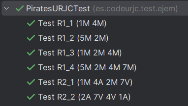

### R2_3

**INPUT y OUTPUT**: "7V 9M 1M 8V" -> "Gana jugador 4"

**R2_3. Código de test**
```java
@Test
@DisplayName("Test R2_3 (7V 9M 1M 8V)")
public void TestR2_3(){
    funcionComparativa("Gana jugador 4", "7V 9M 1M 8V");
}
```
**R2_3. Mensaje del test añadido que NO PASA**

En este caso si que pasa el test añadido ya que esta situación es muy parecida a la del caso anteror.
Tenemos almacenado el numero y letra del primer jugador y lo comparamos con los jugadores que tengan
la misma letra que este.


**R2_3. Código mínimo para que el test pase**

No se han realizado modificaciones, el codigo es idéntico al del caso anteror.


**R2_3. Captura de que TODOS los test PASAN**


### R3_1

**INPUT y OUTPUT**: "2V 6M 3N 8V" -> "Gana jugador 3"

**R3_1. Código de test**
```java
@Test
@DisplayName("Test R3_1 (2V 6M 3N 8V)")
public void TestR3_1(){
    funcionComparativa("Gana jugador 3", "2V 6M 3N 8V");
}
```

**R3_1. Mensaje del test añadido que NO PASA**

```log
org.opentest4j.AssertionFailedError: 
Expected :Gana jugador 3
Actual   :Gana jugador 4
```

**R3_1. Código mínimo para que el test pase**

```java
public String play(String ronda) {
    char letra = ronda.charAt(1);
    int valorMax = Character.getNumericValue(ronda.charAt(0));
    int jugador = 0;
    String[] jugadoresArray = ronda.split(" ");

    for (int i = 0; i < jugadoresArray.length; i++) {
        char jugadorLetra = jugadoresArray[i].charAt(1);
        int jugadorValor = Character.getNumericValue(jugadoresArray[i].charAt(0));

        if ('N'==jugadorLetra){
            return "Gana jugador " + (i+1);
        }
        if (letra == jugadorLetra) {
            if (valorMax < jugadorValor) {
                valorMax = jugadorValor;
                jugador = i;
            }
        }
    }
    return "Gana jugador " + (jugador+1);
}
```
Descripción: Esta vez inicializamos el bucle a 0 para si en cualquier caso se detecta una "N" devuelva como ganador el 
jugador que posea esa carta.

**R3_1. Captura de que TODOS los test PASAN**

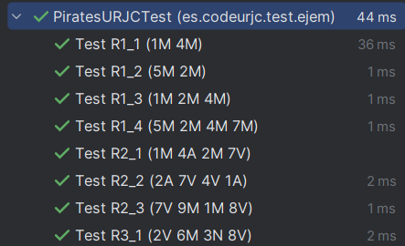

### R3_2

**INPUT y OUTPUT**: "2V 7V 4V 1N" -> "Gana jugador 4"

**R3_2. Código de test**
```java
@Test
@DisplayName("Test R3_2 (2V 7V 4V 1N)")
public void TestR3_2(){
    funcionComparativa("Gana jugador 4", "2V 7V 4V 1N");
}
```

**R3_2. Mensaje del test añadido que NO PASA**

En este caso el test añadido si que pasa ya que, como en el caso anteror, al detectar la primera carta negra devolvemos 
como ganador a ese jugador.

**R3_2. Código mínimo para que el test pase**

No se han realizado modificaciones, debido a que ya abarcaba los requisitos de este caso.

**R3_2. Captura de que TODOS los test PASAN**

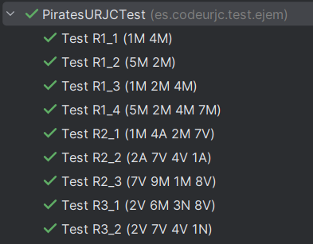

### R3_3

**INPUT y OUTPUT**: "7M 4N 1N 8V" -> "Gana jugador 2"

**R3_3. Código de test**
```java
@Test
@DisplayName("Test R3_3 (7M 4N 1N 8V)")
public void TestR3_3(){
    funcionComparativa("Gana jugador 2", "7M 4N 1N 8V");
}
```

**R3_3. Mensaje del test añadido que NO PASA**

En este caso nos pasa el test debido a que detectamos la primera "N", que en este caso coincide con que
tiene el valor mas alto, pero nos damos cuenta de la verdadera funcionalidad de las cartas negras donde gana 
el jugador que tenga la carta negra con el valor mas alto.

**R3_3. Código mínimo para que el test pase**
```java
    public String play(String ronda) {
        char letra = ronda.charAt(1);
        int valorMax = Character.getNumericValue(ronda.charAt(0));
        int jugador = 0;
        boolean esPrimeraN=false;
        String[] jugadoresArray = ronda.split(" ");

        for (int i = 0; i < jugadoresArray.length; i++) {
            char jugadorLetra = jugadoresArray[i].charAt(1);
            int jugadorValor = Character.getNumericValue(jugadoresArray[i].charAt(0));

            if ('N'==jugadorLetra){
                if (!esPrimeraN){
                    valorMax = jugadorValor;
                    jugador = i;
                    esPrimeraN=true;
                    letra='N';
                }
            }
            if (letra == jugadorLetra) {
                if (valorMax < jugadorValor) {
                    valorMax = jugadorValor;
                    jugador = i;
                }
            }
        }
        return "Gana jugador " + (jugador+1);
    }
```
Descripción: Al detectar una 'N', si esta es la primera, inicializamos el valor de la carta negra como valor máximo y cambiamos la letra que se compara
a 'N'. Si se detecta una segunda simplemente entraría en if que teníamos previamente para comparar los valores numéricos.

**R3_3. Captura de que TODOS los test PASAN**

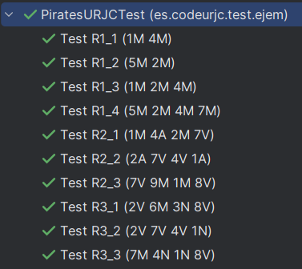

### R4_1

**INPUT y OUTPUT**: "2V 6M 3N SR" -> "Gana jugador 4"

**R4_1. Código de test**
```java
@Test
@DisplayName("Test R4_1 (2V 6M 3N SR)")
public void TestR4_1(){
    funcionComparativa("Gana jugador 4", "2V 6M 3N SR");
}
```

**R4_1. Mensaje del test añadido que NO PASA**

```log
org.opentest4j.AssertionFailedError:
Expected :Gana jugador 4
Actual   :Gana jugador 3
```

**R4_1. Código mínimo para que el test pase**
```java
    public String play(String ronda) {
        char letra = ronda.charAt(1);
        int valorMax = Character.getNumericValue(ronda.charAt(0));
        int jugador = 0;
        boolean esPrimeraN=false;
        String[] jugadoresArray = ronda.split(" ");

        for (int i = 0; i < jugadoresArray.length; i++) {
            char jugadorLetra = jugadoresArray[i].charAt(1);
            int jugadorValor = Character.getNumericValue(jugadoresArray[i].charAt(0));

            if (jugadoresArray[i].equals("SR")){
                return "Gana jugador " + (i+1);
            }
            
            if ('N'==jugadorLetra){
                if (!esPrimeraN){
                    valorMax = jugadorValor;
                    jugador = i;
                    esPrimeraN=true;
                    letra='N';
                }
            }
            if (letra == jugadorLetra) {
                if (valorMax < jugadorValor) {
                    valorMax = jugadorValor;
                    jugador = i;
                }
            }
        }
        return "Gana jugador " + (jugador+1);
    }
```
Descripción: Al detectar el par 'SR', significa que el jugador tiene una carta sirena, por lo que gana a todas las cartas numéricas.

**R4_1. Captura de que TODOS los test PASAN**

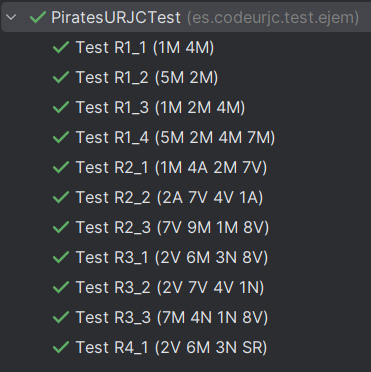

### R4_2

**INPUT y OUTPUT**: "2V SR 4V 1N" -> "Gana jugador 2"

**R4_2. Código de test**
```java
@Test
@DisplayName("Test R4_2 (2V SR 4V 1N)")
public void TestR4_1(){
    funcionComparativa("Gana jugador 2", "2V SR 4V 1N");
}
```

**R4_2. Mensaje del test añadido que NO PASA**

Si que pasa el test debido a que en nuestro código tenemos implementado que al detectar la primera sirena el jugador que 
tenga dicha carta sea el ganador. Este caso es muy similar al anteror.

**R4_2. Código mínimo para que el test pase**

No se han realizado modificaciones, debido a que ya abarcaba los requisitos de este caso.

**R4_2. Captura de que TODOS los test PASAN**

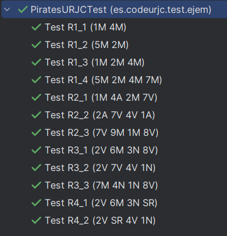

### R5_1

**INPUT y OUTPUT**: "7M SR SR 8V" -> "Gana jugador 3"

**R5_1. Código de test**
```java
@Test
@DisplayName("Test R5_1 (7M SR SR 8V)")
public void TestR5_1 (){
    funcionComparativa("Gana jugador 3", "7M SR SR 8V");
}
```

**R5_1. Mensaje del test añadido que NO PASA**

org.opentest4j.AssertionFailedError:
Expected :Gana jugador 3
Actual   :Gana jugador 2

**R5_1. Código mínimo para que el test pase**

```java
    public String play(String ronda) {
    char letra = ronda.charAt(1);
    int valorMax = Character.getNumericValue(ronda.charAt(0));
    int jugador = 0;
    boolean esPrimeraN=false;
    String[] jugadoresArray = ronda.split(" ");
    boolean sirena = false;

    for (int i = 0; i < jugadoresArray.length; i++) {
        char jugadorLetra = jugadoresArray[i].charAt(1);
        int jugadorValor = Character.getNumericValue(jugadoresArray[i].charAt(0));

        if (jugadoresArray[i].equals("SR")){
            sirena = true;
            jugador = i;
        }

        if (('N'==jugadorLetra) && !sirena){
            if (!esPrimeraN){
                valorMax = jugadorValor;
                jugador = i;
                esPrimeraN=true;
                letra='N';
            }

        }
        if ((letra == jugadorLetra) && !sirena) {
            if (valorMax < jugadorValor) {
                valorMax = jugadorValor;
                jugador = i;
            }
        }
    }
    return "Gana jugador " + (jugador+1);
}
```
Descripción: Añadimos un boolean para que cuando se detecte una carta sirena, solo pueda ganar ese jugador o el siguiente en echar una carta sirena


**R5_1. Captura de que TODOS los test PASAN**


### R6_1

**INPUT y OUTPUT**: "2V PR 3N 1N" -> "Gana jugador 2"

**R6_1. Código de test**
```java
@Test
@DisplayName("Test R6_1 (2V PR 3N 1N)")
public void TestR6_1 (){
    funcionComparativa("Gana jugador 2", "2V PR 3N 1N");
}
```

**R6_1. Mensaje del test añadido que NO PASA**

org.opentest4j.AssertionFailedError:
Expected :Gana jugador 2
Actual   :Gana jugador 3

**R6_1. Código mínimo para que el test pase**

```java
    public String play(String ronda) {
    char letra = ronda.charAt(1);
    int valorMax = Character.getNumericValue(ronda.charAt(0));
    int jugador = 0;
    boolean esPrimeraN=false;
    String[] jugadoresArray = ronda.split(" ");
    boolean sirena = false;

    for (int i = 0; i < jugadoresArray.length; i++) {
        char jugadorLetra = jugadoresArray[i].charAt(1);
        int jugadorValor = Character.getNumericValue(jugadoresArray[i].charAt(0));

        if (jugadoresArray[i].equals("SR")){
            sirena = true;
            jugador = i;
        }

        if (jugadoresArray[i].equals("PR")){
            return "Gana jugador " + (i+1);
        }

        if (('N'==jugadorLetra) && !sirena){
            if (!esPrimeraN){
                valorMax = jugadorValor;
                jugador = i;
                esPrimeraN=true;
                letra='N';
            }

        }
        if ((letra == jugadorLetra) && !sirena) {
            if (valorMax < jugadorValor) {
                valorMax = jugadorValor;
                jugador = i;
            }
        }
    }
    return "Gana jugador " + (jugador+1);
}
```
Descripción: Comprobamos que el par es PR y si se da el caso, gana la mano


**R6_1. Captura de que TODOS los test PASAN**


### R7_1

**INPUT y OUTPUT**: "8A PR 1N PR" -> "Gana jugador 4"

**R7_1. Código de test**
```java
@Test
@DisplayName("Test R7_1 (8A PR 1N PR)")
public void TestR7_1 (){
    funcionComparativa("Gana jugador 4", "8A PR 1N PR");
}
```

**R7_1. Mensaje del test añadido que NO PASA**

org.opentest4j.AssertionFailedError:
Expected :Gana jugador 4
Actual   :Gana jugador 2

**R7_1. Código mínimo para que el test pase**

```java
    public String play(String ronda) {
    char letra = ronda.charAt(1);
    int valorMax = Character.getNumericValue(ronda.charAt(0));
    int jugador = 0;
    boolean esPrimeraN=false;
    String[] jugadoresArray = ronda.split(" ");
    boolean sirena = false;
    boolean pirata = false;

    for (int i = 0; i < jugadoresArray.length; i++) {
        char jugadorLetra = jugadoresArray[i].charAt(1);
        int jugadorValor = Character.getNumericValue(jugadoresArray[i].charAt(0));

        if (jugadoresArray[i].equals("SR")){
            sirena = true;
            jugador = i;
        }

        if (jugadoresArray[i].equals("PR")){
            pirata = true;
            jugador = i;
        }

        if (('N'==jugadorLetra) && !sirena && !pirata){
            if (!esPrimeraN){
                valorMax = jugadorValor;
                jugador = i;
                esPrimeraN=true;
                letra='N';
            }

        }
        if ((letra == jugadorLetra) && !sirena && !pirata) {
            if (valorMax < jugadorValor) {
                valorMax = jugadorValor;
                jugador = i;
            }
        }
    }
    return "Gana jugador " + (jugador+1);
}
```
Descripción: Añadimos un boolean para que cuando se detecte una carta pirata, solo pueda ganar ese jugador o el siguiente en echar una carta pirata


**R7_1. Captura de que TODOS los test PASAN**


**R7_1. Refactorización**

Justificación: Podemos observar que el funcionamiento de la carta sirena es igual al de la carta pirata por lo que podemos agrupar los dos if y sus booleans
```java
    public String play(String ronda) {
    char letra = ronda.charAt(1);
    int valorMax = Character.getNumericValue(ronda.charAt(0));
    int jugador = 0;
    boolean esPrimeraN=false;
    String[] jugadoresArray = ronda.split(" ");
    boolean cartaEspecial = false;

    for (int i = 0; i < jugadoresArray.length; i++) {
        char jugadorLetra = jugadoresArray[i].charAt(1);
        int jugadorValor = Character.getNumericValue(jugadoresArray[i].charAt(0));

        if (jugadoresArray[i].equals("SR") || (jugadoresArray[i].equals("PR"))){
            cartaEspecial = true;
            jugador = i;
        }

        if (('N'==jugadorLetra) && !cartaEspecial){
            if (!esPrimeraN){
                valorMax = jugadorValor;
                jugador = i;
                esPrimeraN=true;
                letra='N';
            }

        }
        if ((letra == jugadorLetra) && !cartaEspecial) {
            if (valorMax < jugadorValor) {
                valorMax = jugadorValor;
                jugador = i;
            }
        }
    }
    return "Gana jugador " + (jugador+1);
}
```
**R7_1. Captura de que TODOS los tests PASAN tras la refactorización**


### R8_1

**INPUT y OUTPUT**: "9V PR 4V SR" -> "Gana jugador 2"

**R8_1. Código de test**
```java
@Test
@DisplayName("Test R8_1 (9V PR 4V SR)")
public void TestR8_1 (){
    funcionComparativa("Gana jugador 2", "9V PR 4V SR");
}
```

**R8_1. Mensaje del test añadido que NO PASA**

org.opentest4j.AssertionFailedError:
Expected :Gana jugador 2
Actual   :Gana jugador 4

**R8_1. Código mínimo para que el test pase**

```java

public String play(String ronda) {
    char letra = ronda.charAt(1);
    int valorMax = Character.getNumericValue(ronda.charAt(0));
    int jugador = 0;
    boolean esPrimeraN=false;
    String[] jugadoresArray = ronda.split(" ");
    boolean cartaEspecial = false;
    boolean pirata = false;


    for (int i = 0; i < jugadoresArray.length; i++) {
        char jugadorLetra = jugadoresArray[i].charAt(1);
        int jugadorValor = Character.getNumericValue(jugadoresArray[i].charAt(0));

        if (jugadoresArray[i].equals("SR") || (jugadoresArray[i].equals("PR"))){
            cartaEspecial = true;
            if (jugadoresArray[i].equals("PR")) {
                pirata = true;
                jugador = i;
            }
            if (jugadoresArray[i].equals("SR") && !pirata)
                jugador = i;

        }

        if (('N'==jugadorLetra) && !cartaEspecial){
            if (!esPrimeraN){
                valorMax = jugadorValor;
                jugador = i;
                esPrimeraN=true;
                letra='N';
            }

        }
        if ((letra == jugadorLetra) && !cartaEspecial) {
            if (valorMax < jugadorValor) {
                valorMax = jugadorValor;
                jugador = i;
            }
        }
    }
    return "Gana jugador " + (jugador+1);
}
```
Descripción: Comprobamos con un boolean que se juegue una carta pirata por si se juega tambien una sirena

**R8_1. Captura de que TODOS los test PASAN**

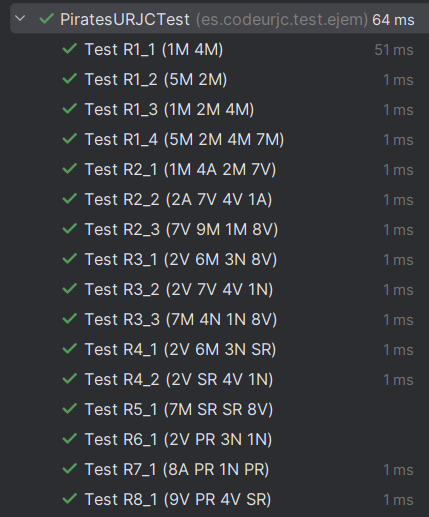

### R8_2

**INPUT y OUTPUT**: "9V PR 4V SR" -> "Gana jugador 2"

**R8_2. Código de test**
```java
@Test
@DisplayName("Test R8_2 (SR SR PR SR)")
public void TestR8_2 (){
    funcionComparativa("Gana jugador 3", "SR SR PR SR");
}
```

**R8_2. Mensaje del test añadido que NO PASA**

Si que pasa el test debido a que en nuestro código tenemos implementado que al detectar una carta pirata si se juega una sirena, la pirata será ganadora.

**R8_2. Código mínimo para que el test pase**

No se han realizado modificaciones, debido a que ya abarcaba los requisitos de este caso.

**R8_2. Captura de que TODOS los test PASAN**

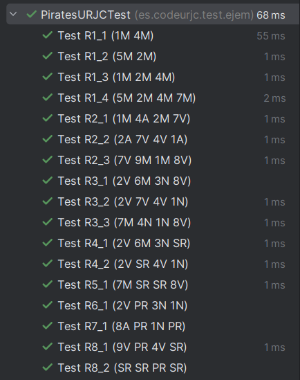

### R9_1

**INPUT y OUTPUT**: "7N 8A 1V SK" -> "Gana jugador 4"

**R9_1. Código de test**
```java
@Test
@DisplayName("Test R9_1 (7N 8A 1V SK)")
public void TestR9_1 (){
    funcionComparativa("Gana jugador 4", "7N 8A 1V SK");
}
```

**R9_1. Mensaje del test añadido que NO PASA**

org.opentest4j.AssertionFailedError:
Expected :Gana jugador 4
Actual   :Gana jugador 1

**R9_1. Código mínimo para que el test pase**

```java
    public String play(String ronda) {
    char letra = ronda.charAt(1);
    int valorMax = Character.getNumericValue(ronda.charAt(0));
    int jugador = 0;
    boolean esPrimeraN=false;
    String[] jugadoresArray = ronda.split(" ");
    boolean cartaEspecial = false;
    boolean pirata = false;


    for (int i = 0; i < jugadoresArray.length; i++) {
        char jugadorLetra = jugadoresArray[i].charAt(1);
        int jugadorValor = Character.getNumericValue(jugadoresArray[i].charAt(0));

        if (jugadoresArray[i].equals("SR") || jugadoresArray[i].equals("PR") || jugadoresArray[i].equals("SK")){
            cartaEspecial = true;
            if (jugadoresArray[i].equals("SK") && !pirata){
                jugador = i;
            }
            if (jugadoresArray[i].equals("PR")) {
                pirata = true;
                jugador = i;
            }
            if (jugadoresArray[i].equals("SR") && !pirata)
                jugador = i;

        }

        if (('N'==jugadorLetra) && !cartaEspecial){
            if (!esPrimeraN){
                valorMax = jugadorValor;
                jugador = i;
                esPrimeraN=true;
                letra='N';
            }

        }
        if ((letra == jugadorLetra) && !cartaEspecial) {
            if (valorMax < jugadorValor) {
                valorMax = jugadorValor;
                jugador = i;
            }
        }
    }
    return "Gana jugador " + (jugador+1);
}
```
Descripción: Añadimos la carta SK como una carta especial con un funcionamiento igual al de sirena

**R9_1. Captura de que TODOS los test PASAN**


### R9_2

**INPUT y OUTPUT**: "2V PR SK 1N" -> "Gana jugador 3"

**R9_2. Código de test**
```java
@Test
@DisplayName("Test R9_2 (2V PR SK 1N)")
public void TestR9_2 (){
    funcionComparativa("Gana jugador 3", "2V PR SK 1N");
}
```

**R9_2. Mensaje del test añadido que NO PASA**

org.opentest4j.AssertionFailedError:
Expected :Gana jugador 3
Actual   :Gana jugador 2

**R9_2. Código mínimo para que el test pase**

```java
    public String play(String ronda) {
    char letra = ronda.charAt(1);
    int valorMax = Character.getNumericValue(ronda.charAt(0));
    int jugador = 0;
    boolean esPrimeraN=false;
    String[] jugadoresArray = ronda.split(" ");
    boolean cartaEspecial = false;
    boolean pirata = false;
    boolean sk = false;


    for (int i = 0; i < jugadoresArray.length; i++) {
        char jugadorLetra = jugadoresArray[i].charAt(1);
        int jugadorValor = Character.getNumericValue(jugadoresArray[i].charAt(0));

        if (jugadoresArray[i].equals("SR") || jugadoresArray[i].equals("PR") || jugadoresArray[i].equals("SK")){
            cartaEspecial = true;
            if (jugadoresArray[i].equals("SK")){
                sk = true;
                jugador = i;
            }
            if (jugadoresArray[i].equals("PR") && !sk) {
                pirata = true;
                jugador = i;
            }
            if (jugadoresArray[i].equals("SR") && !pirata)
                jugador = i;

        }

        if (('N'==jugadorLetra) && !cartaEspecial){
            if (!esPrimeraN){
                valorMax = jugadorValor;
                jugador = i;
                esPrimeraN=true;
                letra='N';
            }

        }
        if ((letra == jugadorLetra) && !cartaEspecial) {
            if (valorMax < jugadorValor) {
                valorMax = jugadorValor;
                jugador = i;
            }
        }
    }
    return "Gana jugador " + (jugador+1);
}
```
Descripción: Hacemos que la carta skull king active un booleano que permita que gane a la pirata

**R9_2. Captura de que TODOS los test PASAN**

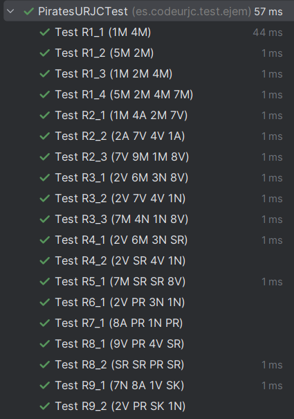

### R9_3

**INPUT y OUTPUT**: "1N SK 4V SR" -> "Gana jugador 2"

**R9_3. Código de test**
```java
@Test
@DisplayName("Test R9_3 (1N SK 4V SR)")
public void TestR9_3 (){
    funcionComparativa("Gana jugador 2", "1N SK 4V SR");
}
```

**R9_3. Mensaje del test añadido que NO PASA**

org.opentest4j.AssertionFailedError:
Expected :Gana jugador 3
Actual   :Gana jugador 4

**R9_3. Código mínimo para que el test pase**

```java
    public String play(String ronda) {
    char letra = ronda.charAt(1);
    int valorMax = Character.getNumericValue(ronda.charAt(0));
    int jugador = 0;
    boolean esPrimeraN=false;
    String[] jugadoresArray = ronda.split(" ");
    boolean cartaEspecial = false;
    boolean pirata = false;
    boolean sk = false;


    for (int i = 0; i < jugadoresArray.length; i++) {
        char jugadorLetra = jugadoresArray[i].charAt(1);
        int jugadorValor = Character.getNumericValue(jugadoresArray[i].charAt(0));

        if (jugadoresArray[i].equals("SR") || jugadoresArray[i].equals("PR") || jugadoresArray[i].equals("SK")){
            cartaEspecial = true;
            if (jugadoresArray[i].equals("SK")){
                sk = true;
                jugador = i;
            }
            if (jugadoresArray[i].equals("PR") && !sk) {
                pirata = true;
                jugador = i;
            }
            if (jugadoresArray[i].equals("SR") && !(pirata || sk)){
                jugador = i;
            }
        }

        if (('N'==jugadorLetra) && !cartaEspecial){
            if (!esPrimeraN){
                valorMax = jugadorValor;
                jugador = i;
                esPrimeraN=true;
                letra='N';
            }

        }
        if ((letra == jugadorLetra) && !cartaEspecial) {
            if (valorMax < jugadorValor) {
                valorMax = jugadorValor;
                jugador = i;
            }
        }
    }
    return "Gana jugador " + (jugador+1);
}
```
Descripción: Añadimos a SR que cuando se juegue otra carta especial SR pierda

**R9_3. Captura de que TODOS los test PASAN**

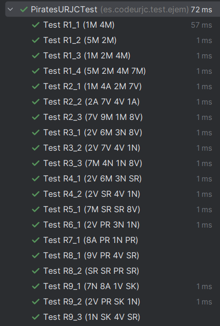

**R9_3. Refactorización**

Justificación: Traducción del código al inglés
```java
    public String play(String ronda) {
    char letter = ronda.charAt(1);
    int maxValue = Character.getNumericValue(ronda.charAt(0));
    int player = 0;
    boolean firstN =false;
    String[] playersArray = ronda.split(" ");
    boolean specialCart = false;
    boolean pirate = false;
    boolean skull_king = false;


    for (int i = 0; i < playersArray.length; i++) {
        char player_Colour = playersArray[i].charAt(1);
        int player_Number = Character.getNumericValue(playersArray[i].charAt(0));

        if (playersArray[i].equals("SR") || playersArray[i].equals("PR") || playersArray[i].equals("SK")){
            specialCart = true;
            if (playersArray[i].equals("SK")){
                skull_king = true;
                player = i;
            }
            if (playersArray[i].equals("PR") && !skull_king) {
                pirate = true;
                player = i;
            }
            if (playersArray[i].equals("SR") && !(pirate || skull_king)){
                player = i;
            }
        }

        if (('N'==player_Colour) && !specialCart){
            if (!firstN){
                maxValue = player_Number;
                player = i;
                firstN=true;
                letter='N';
            }

        }
        if ((letter == player_Colour) && !specialCart) {
            if (maxValue < player_Number) {
                maxValue = player_Number;
                player = i;
            }
        }
    }
    return "Gana jugador " + (player+1);
}

```
**R9_3 Captura de que TODOS los tests PASAN tras la refactorización**


### R10_1

**INPUT y OUTPUT**: "PR SK SR SR" -> "Gana jugador 3"

**R10_1. Código de test**
```java
@Test
@DisplayName("Test R10_1 (PR SK SR SR)")
public void TestR10_1 (){
    funcionComparativa("Gana jugador 3", "PR SK SR SR");
}
```

**R10_1. Mensaje del test añadido que NO PASA**

org.opentest4j.AssertionFailedError:
Expected :Gana jugador 3
Actual   :Gana jugador 2

**R10_1. Código mínimo para que el test pase**

```java
public String play(String ronda) {
    char letter = ronda.charAt(1);
    int maxValue = Character.getNumericValue(ronda.charAt(0));
    int player = 0;
    boolean firstN=false;
    String[] playersArray = ronda.split(" ");
    boolean specialCart = false;
    boolean pirate = false;
    boolean skull_king = false;


    for (int i = 0; i < playersArray.length; i++) {
        char player_Colour = playersArray[i].charAt(1);
        int player_Number = Character.getNumericValue(playersArray[i].charAt(0));

        if (playersArray[i].equals("SR") || playersArray[i].equals("PR") || playersArray[i].equals("SK")){
            specialCart = true;
            if (playersArray[i].equals("SK")){
                skull_king = true;
                player = i;
                if ((i != playersArray.length-1)&&(playersArray[i+1].equals("SR"))){
                    player = i+1;
                }
            }
            if (playersArray[i].equals("PR") && !skull_king) {
                pirate = true;
                player = i;
            }
            if (playersArray[i].equals("SR") && !(pirate || skull_king)){
                player = i;
            }
        }

        if (('N'==player_Colour) && !specialCart){
            if (!firstN){
                maxValue = player_Number;
                player = i;
                firstN=true;
                letter='N';
            }

        }
        if ((letter == player_Colour) && !specialCart) {
            if (maxValue < player_Number) {
                maxValue = player_Number;
                player = i;
            }
        }
    }
    return "Gana jugador " + (player+1);
}
```
Descripción: Añadimos una condicion if para que si un jugador tiene una carta skull king comprobar si este no es el último 
jugador y si el siguiente jugador tiene una carta sirena. Si esto ocurre ganaría el jugador que tiene la carta sirena.

**R10_1. Captura de que TODOS los test PASAN**


### R11_1

**INPUT y OUTPUT**: "1V KK SR" -> "Gana jugador 1"

**R11_1. Código de test**
```java
@Test
@DisplayName("Test R11_1 (1V KK SR)")
public void TestR11_1 (){
    funcionComparativa("Gana jugador 1", "1V KK SR");
}
```

**R11_1. Mensaje del test añadido que NO PASA**

org.opentest4j.AssertionFailedError:
Expected :Gana jugador 1
Actual   :Gana jugador 3

**R11_1. Código mínimo para que el test pase**
```java
    public String play(String ronda) {
    char letter = ronda.charAt(1);
    int maxValue = Character.getNumericValue(ronda.charAt(0));
    int player = 0;
    boolean firstN=false;
    String[] playersArray = ronda.split(" ");
    boolean specialCart = false;
    boolean pirate = false;
    boolean skull_king = false;
    boolean kraken = false;


    for (int i = 0; i < playersArray.length; i++) {
        char player_Colour = playersArray[i].charAt(1);
        int player_Number = Character.getNumericValue(playersArray[i].charAt(0));

        if ((playersArray[i].equals("SR") || playersArray[i].equals("PR") || playersArray[i].equals("SK") || playersArray[i].equals("KK"))){
            specialCart = true;
            if (playersArray[i].equals("SK")){
                skull_king = true;
                player = i;
                if ((i != playersArray.length-1)&&(playersArray[i+1].equals("SR"))){
                    player = i+1;
                }
            }
            if (playersArray[i].equals("PR") && !skull_king) {
                pirate = true;
                player = i;
            }
            if (playersArray[i].equals("SR") && !(pirate || skull_king || kraken)){
                player = i;
            }
            if (playersArray[i].equals("KK") && !skull_king){
                kraken = true;
            }
        }

        if (('N'==player_Colour) && !specialCart){
            if (!firstN){
                maxValue = player_Number;
                player = i;
                firstN=true;
                letter='N';
                maxNumericValue = i;
            }

        }
        if ((letter == player_Colour) && !specialCart) {
            if (maxValue < player_Number) {
                maxValue = player_Number;
                player = i;
            }
        }
    }
    return "Gana jugador " + (player+1);
}
```
Descripción: Añadimos booleano de kraken que omitirá si se juegan cartas sirenas
**R11_1. Captura de que TODOS los test PASAN**

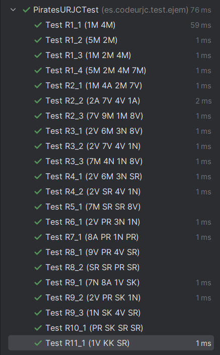


### R11_2

**INPUT y OUTPUT**: "1V KK SR" -> "Gana jugador 1"

**R11_2. Código de test**
```java
@Test
@DisplayName("Test R11_2 (5A PR KK)")
public void TestR11_2 (){
    funcionComparativa("Gana jugador 1", "5A PR KK");
}
```

**R11_2. Mensaje del test añadido que NO PASA**

org.opentest4j.AssertionFailedError:
Expected :Gana jugador 1
Actual   :Gana jugador 2

**R11_2. Código mínimo para que el test pase**
```java
    public String play(String ronda) {
    char letter = ronda.charAt(1);
    int maxValue = Character.getNumericValue(ronda.charAt(0));
    int player = 0;
    boolean firstN=false;
    String[] playersArray = ronda.split(" ");
    boolean specialCart = false;
    boolean pirate = false;
    boolean skull_king = false;
    boolean kraken = false;


    for (int i = 0; i < playersArray.length; i++) {
        char player_Colour = playersArray[i].charAt(1);
        int player_Number = Character.getNumericValue(playersArray[i].charAt(0));

        if ((playersArray[i].equals("SR") || playersArray[i].equals("PR") || playersArray[i].equals("SK") || playersArray[i].equals("KK"))){
            specialCart = true;
            if (playersArray[i].equals("SK")){
                skull_king = true;
                player = i;
                if ((i != playersArray.length-1)&&(playersArray[i+1].equals("SR"))){
                    player = i+1;
                }
            }
            if (playersArray[i].equals("PR") && !(skull_king || kraken)) {
                pirate = true;
                if ((i != playersArray.length-1)&&!(playersArray[i+1].equals("KK"))){
                    player = i;
                }
                if(i == playersArray.length-1){
                    player = i;
                }
            }
            if (playersArray[i].equals("SR") && !(pirate || skull_king || kraken)){
                player = i;
            }
            if (playersArray[i].equals("KK") && !skull_king){
                kraken = true;
            }
        }

        if (('N'==player_Colour) && !specialCart){
            if (!firstN){
                maxValue = player_Number;
                player = i;
                firstN=true;
                letter='N';
            }

        }
        if ((letter == player_Colour) && !specialCart) {
            if (maxValue < player_Number) {
                maxValue = player_Number;
                player = i;
            }
        }
    }
    return "Gana jugador " + (player+1);
}
```
Descripción: Al igual que antes, añadimos el booleano a pirates por si sale despues de kk. Comprobamos que despues del pirata no aparezcan kk
**R11_2. Captura de que TODOS los test PASAN**

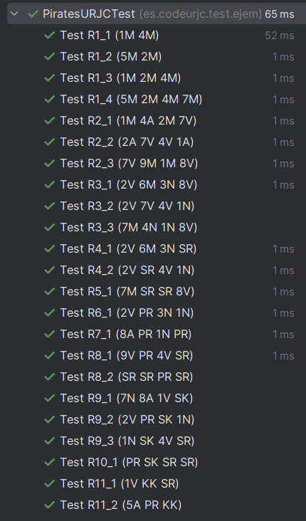

### R11_3

**INPUT y OUTPUT**: "7M SK KK" -> "Gana jugador 1"

**R11_3. Código de test**
```java
@Test
@DisplayName("Test R11_3 (7M SK KK)")
public void TestR11_3 (){
    funcionComparativa("Gana jugador 1", "7M SK KK");
}
```

**R11_3. Mensaje del test añadido que NO PASA**

org.opentest4j.AssertionFailedError:
Expected :Gana jugador 1
Actual   :Gana jugador 2

**R11_3. Código mínimo para que el test pase**
```java
    public String play(String ronda) {
    char letter = ronda.charAt(1);
    int maxValue = Character.getNumericValue(ronda.charAt(0));
    int player = 0;
    boolean firstN=false;
    String[] playersArray = ronda.split(" ");
    boolean specialCart = false;
    boolean pirate = false;
    boolean skull_king = false;
    boolean kraken = false;
    //int maxNumericValue = 0;


    for (int i = 0; i < playersArray.length; i++) {
        char player_Colour = playersArray[i].charAt(1);
        int player_Number = Character.getNumericValue(playersArray[i].charAt(0));

        if ((playersArray[i].equals("SR") || playersArray[i].equals("PR") || playersArray[i].equals("SK") || playersArray[i].equals("KK"))){
            specialCart = true;
            if (playersArray[i].equals("SK") && !kraken){
                skull_king = true;
                if ((i != playersArray.length-1)&&!(playersArray[i+1].equals("KK"))){
                    player = i;
                }
                if(i == playersArray.length-1){
                    player = i;
                }
                if ((i != playersArray.length-1)&&(playersArray[i+1].equals("SR"))){
                    player = i+1;
                }
            }
            if (playersArray[i].equals("PR") && !(skull_king || kraken)) {
                pirate = true;
                if ((i != playersArray.length-1)&&!(playersArray[i+1].equals("KK"))){
                    player = i;
                }
                if(i == playersArray.length-1){
                    player = i;
                }
            }
            if (playersArray[i].equals("SR") && !(pirate || skull_king || kraken)){
                player = i;
            }
            if (playersArray[i].equals("KK")){
                kraken = true;
                //player = maxNumericValue;
            }
        }

        if (('N'==player_Colour) && !specialCart){
            if (!firstN){
                maxValue = player_Number;
                player = i;
                firstN=true;
                letter='N';
                //maxNumericValue = i;
            }

        }
        if ((letter == player_Colour) && !specialCart) {
            if (maxValue < player_Number) {
                maxValue = player_Number;
                player = i;
                //maxNumericValue = i;
            }
        }
    }
    return "Gana jugador " + (player+1);
}
```
Descripción: Igual que con las cartas piratas, verificamos que no se juegue detras una carta kraken
**R11_3. Captura de que TODOS los test PASAN**


**R11_3. Refactorización**

Justificación: Nos hemos dado cuenta de que no estabamos gestionando correctamente como guardábamos los valores del palo de la primera letra y el valor máximo de las letras, pues tomamamos cartas no numéricas para guardar estos valores generando valores no realistas. Hemos añadido una nueva comprobación para gestionarlo de forma correcta
```java
public String play(String ronda) {
    char letter= ' ';
    int maxValue;

    if (!Character.isLetter(ronda.charAt(0))){
        maxValue=Character.getNumericValue(ronda.charAt(0));
    } else {
        maxValue=0;
    }
    boolean entered=false;

    int player = 0;
    boolean firstN=false;
    String[] playersArray = ronda.split(" ");
    boolean specialCart = false;
    boolean pirate = false;
    boolean skull_king = false;
    boolean kraken = false;
    int maxNumericValue = 0;
    int player_Number;


    for (int i = 0; i < playersArray.length; i++) {
        char player_Colour = playersArray[i].charAt(1);

        if (!Character.isLetter(playersArray[i].charAt(0))){
            player_Number=Character.getNumericValue(playersArray[i].charAt(0));
        } else {
            player_Number=0;
        }

        if (((playersArray[i].charAt(1)=='N')||(playersArray[i].charAt(1)=='A')||(playersArray[i].charAt(1)=='M')||(playersArray[i].charAt(1)=='V'))&&(!entered)){
            letter=playersArray[i].charAt(1);
            entered=true;
        }

        if (((playersArray[i].equals("SR") || playersArray[i].equals("PR") || playersArray[i].equals("SK") || playersArray[i].equals("KK"))) && !kraken){
            specialCart = true;
            if (playersArray[i].equals("KK")){
                kraken = true;
                specialCart = false;
                player = maxNumericValue;
            }
            if (playersArray[i].equals("SK") && !kraken){
                skull_king = true;
                if ((i != playersArray.length-1)&&!(playersArray[i+1].equals("KK"))){
                    player = i;
                }
                if(i == playersArray.length-1){
                    player = i;
                }
                if ((i != playersArray.length-1)&&(playersArray[i+1].equals("SR"))){
                    player = i+1;
                }
            }
            if (playersArray[i].equals("PR") && !(skull_king || kraken)) {
                pirate = true;
                if ((i != playersArray.length-1)&&!(playersArray[i+1].equals("KK"))){
                    player = i;
                }
                if(i == playersArray.length-1){
                    player = i;
                }
            }
            if (playersArray[i].equals("SR") && !(pirate || skull_king || kraken)){
                player = i;
            }
        }

        if (('N'==player_Colour) && !specialCart){
            if (!firstN){
                maxValue = player_Number;
                player = i;
                firstN=true;
                letter='N';
                maxNumericValue = i;
            }

        }
        if (!specialCart && (letter == player_Colour)) {
            if (maxValue < player_Number) {
                maxValue = player_Number;
                player = i;
                maxNumericValue = i;
            }
        }
    }
    if (kraken){
        return "Gana jugador " + (maxNumericValue + 1);
    }
    return "Gana jugador " + (player+1);
}
```
**R11_3 Captura de que TODOS los tests PASAN tras la refactorización**


### R11_4

**INPUT y OUTPUT**: "“KK SK 5A SR" -> "Gana jugador 3"

**R11_4. Código de test**
```java
@Test
@DisplayName("Test R11_4 (“KK SK 5A SR)")
public void TestR11_4 (){
    funcionComparativa("Gana jugador 3", "“KK SK 5A SR");
}
```

**R11_4. Mensaje del test añadido que NO PASA**

org.opentest4j.AssertionFailedError:
Expected :Gana jugador 3
Actual   :Gana jugador 2

**R11_4. Código mínimo para que el test pase**
```java
public String play(String ronda) {
    char letter= ' ';
    int maxValue;

    if (!Character.isLetter(ronda.charAt(0))){
        maxValue=Character.getNumericValue(ronda.charAt(0));
    } else {
        maxValue=0;
    }
    boolean entered=false;

    int player = 0;
    boolean firstN=false;
    String[] playersArray = ronda.split(" ");
    boolean specialCart = false;
    boolean pirate = false;
    boolean skull_king = false;
    boolean kraken = false;
    int maxNumericValue = 0;
    int player_Number;


    for (int i = 0; i < playersArray.length; i++) {
        char player_Colour = playersArray[i].charAt(1);

        if (!Character.isLetter(playersArray[i].charAt(0))){
            player_Number=Character.getNumericValue(playersArray[i].charAt(0));
        } else {
            player_Number=0;
        }

        if (((playersArray[i].charAt(1)=='N')||(playersArray[i].charAt(1)=='A')||(playersArray[i].charAt(1)=='M')||(playersArray[i].charAt(1)=='V'))&&(!entered)){
            letter=playersArray[i].charAt(1);
            entered=true;
        }

        if (((playersArray[i].equals("SR") || playersArray[i].equals("PR") || playersArray[i].equals("SK") || playersArray[i].equals("KK"))) && !kraken){
            specialCart = true;
            if (playersArray[i].equals("KK")){
                kraken = true;
                specialCart = false;
                player = maxNumericValue;
            }
            if (playersArray[i].equals("SK") && !kraken){
                skull_king = true;
                if ((i != playersArray.length-1)&&!(playersArray[i+1].equals("KK"))){
                    player = i;
                }
                if(i == playersArray.length-1){
                    player = i;
                }
                if ((i != playersArray.length-1)&&(playersArray[i+1].equals("SR"))){
                    player = i+1;
                }
            }
            if (playersArray[i].equals("PR") && !(skull_king || kraken)) {
                pirate = true;
                if ((i != playersArray.length-1)&&!(playersArray[i+1].equals("KK"))){
                    player = i;
                }
                if(i == playersArray.length-1){
                    player = i;
                }
            }
            if (playersArray[i].equals("SR") && !(pirate || skull_king || kraken)){
                player = i;
            }
        }

        if (('N'==player_Colour) && !specialCart){
            if (!firstN){
                maxValue = player_Number;
                player = i;
                firstN=true;
                letter='N';
                maxNumericValue = i;
            }

        }
        if (!specialCart && (letter == player_Colour)) {
            if (maxValue < player_Number) {
                maxValue = player_Number;
                player = i;
                maxNumericValue = i;
            }
        }
    }
    if (kraken){
        return "Gana jugador " + (maxNumericValue + 1);
    }
    return "Gana jugador " + (player+1);
}
```
Descripción: Cuando el KK se juega primero invalida el resto de cartas especiales
**R11_4. Captura de que TODOS los test PASAN**


**R11_4. Refactorización**

Justificación: Mejora en la legibilidad y claridad del codigo añadiendo tres operaciones ternarias y con la creación de constantes para búsquedas redundantes
```java
public class PiratesURJC {
    private static final String MERMAID = "SR";
    private static final String PIRATE = "PR";
    private static final String SKULL_KING = "SK";
    private static final String KRAKEN = "KK";
    private static final char YELLOW = 'A';
    private static final char PURPLE = 'M';
    private static final char GREEN = 'V';
    private static final char BLACK = 'N';

    public String play(String ronda) {
        char letter = ' ';
        int maxValue = Character.isDigit(ronda.charAt(0)) ? Character.getNumericValue(ronda.charAt(0)) : 0;

        int player = 0;
        boolean firstN = false;
        String[] playersArray = ronda.split(" ");
        boolean specialCart = false;
        boolean pirate = false;
        boolean skull_king = false;
        boolean kraken = false;
        int maxNumericValue = 0;
        int player_Number;

        boolean foundSpecialCart = false;

        for (int i = 0; i < playersArray.length; i++) {
            char player_Colour = playersArray[i].charAt(1);
            player_Number = Character.isDigit(playersArray[i].charAt(0)) ? Character.getNumericValue(playersArray[i].charAt(0)) : 0;

            if ((player_Colour == BLACK || player_Colour == YELLOW || player_Colour == PURPLE || player_Colour == GREEN) && !foundSpecialCart) {
                letter = player_Colour;
                foundSpecialCart = true;
            }

            if ((playersArray[i].equals(MERMAID) || playersArray[i].equals(PIRATE) || playersArray[i].equals(SKULL_KING) || playersArray[i].equals(KRAKEN)) && !kraken) {
                specialCart = true;
                if (playersArray[i].equals(KRAKEN)) {
                    kraken = true;
                    specialCart = false;
                    player = maxNumericValue;
                }
                if (playersArray[i].equals(SKULL_KING) && !kraken) {
                    skull_king = true;
                    if ((i != playersArray.length - 1) && !(playersArray[i + 1].equals(KRAKEN))) {
                        player = i;
                    }
                    if (i == playersArray.length - 1) {
                        player = i;
                    }
                    if ((i != playersArray.length - 1) && (playersArray[i + 1].equals(MERMAID))) {
                        player = i + 1;
                    }
                }
                if (playersArray[i].equals(PIRATE) && !(skull_king || kraken)) {
                    pirate = true;
                    if ((i != playersArray.length - 1) && !(playersArray[i + 1].equals(KRAKEN))) {
                        player = i;
                    }
                    if (i == playersArray.length - 1) {
                        player = i;
                    }
                }
                if (playersArray[i].equals(MERMAID) && !(pirate || skull_king || kraken)) {
                    player = i;
                }
            }

            if ((BLACK == player_Colour) && !specialCart) {
                if (!firstN) {
                    maxValue = player_Number;
                    player = i;
                    firstN = true;
                    letter = BLACK;
                    maxNumericValue = i;
                }

            }
            if (!specialCart && (letter == player_Colour)) {
                if (maxValue < player_Number) {
                    maxValue = player_Number;
                    player = i;
                    maxNumericValue = i;
                }
            }
        }
        return "Gana jugador " + (kraken ? (maxNumericValue + 1) : (player + 1));
    }
}
```
**R11_4 Captura de que TODOS los tests PASAN tras la refactorización**


**R11_4. Refactorización**

Justificación: Partes del código las gestionamos con métodos facilitando su comprensión y claridad. En concreto isColorOfInterest para ver si se juega una cartaNumerica, isSpecialCard para ver si se juega una carta especial y handleSkullKing para todo lo relacionado con skullKing
```java
public class PiratesURJC {
    private static final String MERMAID = "SR";
    private static final String PIRATE = "PR";
    private static final String SKULL_KING = "SK";
    private static final String KRAKEN = "KK";
    private static final char YELLOW = 'A';
    private static final char PURPLE = 'M';
    private static final char GREEN = 'V';
    private static final char BLACK = 'N';

    public String play(String ronda) {
        char letter = ' ';
        int maxValue = Character.isDigit(ronda.charAt(0)) ? Character.getNumericValue(ronda.charAt(0)) : 0;

        int player = 0;
        boolean firstN = false;
        String[] playersArray = ronda.split(" ");
        boolean specialCart = false;
        boolean pirate = false;
        boolean skull_king = false;
        boolean kraken = false;
        int maxNumericValue = 0;
        int player_Number;

        boolean foundSpecialCart = false;

        for (int i = 0; i < playersArray.length; i++) {
            char player_Colour = playersArray[i].charAt(1);
            player_Number = Character.isDigit(playersArray[i].charAt(0)) ? Character.getNumericValue(playersArray[i].charAt(0)) : 0;

            if (isColorOfInterest(player_Colour) && !foundSpecialCart) {
                letter = player_Colour;
                foundSpecialCart = true;
            }

            if (isSpecialCard(playersArray[i]) && !kraken) {
                specialCart = true;
                if (playersArray[i].equals(KRAKEN)) {
                    kraken = true;
                    specialCart = false;
                    player = maxNumericValue;
                }
                if (playersArray[i].equals(SKULL_KING) && !kraken) {
                    skull_king = true;
                    if (playersArray[i].equals(SKULL_KING)) {
                        player = handleSkullKing(playersArray, i, kraken);
                    }
                }
                if (playersArray[i].equals(PIRATE) && !(skull_king || kraken)) {
                    pirate = true;
                    if ((i != playersArray.length - 1) && !(playersArray[i + 1].equals(KRAKEN))) {
                        player = i;
                    }
                    if (i == playersArray.length - 1) {
                        player = i;
                    }
                }
                if (playersArray[i].equals(MERMAID) && !(pirate || skull_king || kraken)) {
                    player = i;
                }
            }

            if ((BLACK == player_Colour) && !specialCart) {
                if (!firstN) {
                    maxValue = player_Number;
                    player = i;
                    firstN = true;
                    letter = BLACK;
                    maxNumericValue = i;
                }

            }
            if (!specialCart && (letter == player_Colour)) {
                if (maxValue < player_Number) {
                    maxValue = player_Number;
                    player = i;
                    maxNumericValue = i;
                }
            }
        }
        return "Gana jugador " + (kraken ? (maxNumericValue + 1) : (player+1));
    }
    private boolean isSpecialCard(String card) {
        return card.equals(MERMAID) || card.equals(PIRATE) || card.equals(SKULL_KING) || card.equals(KRAKEN);
    }
    private int handleSkullKing(String[] playersArray, int index, boolean kraken) {
        if (!kraken) {
            if (index != playersArray.length - 1) {
                if (playersArray[index + 1].equals(MERMAID)) {
                    return index + 1;  // Skip Skull King and return the index of the player who played the Sirena
                } else if (!playersArray[index + 1].equals(KRAKEN)) {
                    return index;  // Return the index of Skull King if it's not followed by Kraken or Sirena
                }
            }
            return index;  // Returns the current player index if it's the last card or no special conditions are met
        }
        return index;  // Default return if kraken is true
    }
    private boolean isColorOfInterest(char color) {
        return color == BLACK || color == YELLOW || color == PURPLE || color == GREEN;
    }

}
```
**R11_4 Captura de que TODOS los tests PASAN tras la refactorización**


### R12_1

**INPUT y OUTPUT**: "PR KK SR PR" -> "Gana jugador 2"

**R12_1. Código de test**
```java
@Test
@DisplayName("Test R12_1 (“PR KK SR PR)")
public void TestR12_1 (){
    funcionComparativa("Gana jugador 2", "“PR KK SR PR");
}
```

**R12_1. Mensaje del test añadido que NO PASA**

Expected :Gana jugador 2
Actual   :Gana jugador 1

**R12_1. Código mínimo para que el test pase**
```java
public String play(String ronda) {
    char letter= ' ';
    int maxValue;

    if (!Character.isLetter(ronda.charAt(0))){
        maxValue=Character.getNumericValue(ronda.charAt(0));
    } else {
        maxValue=0;
    }
    boolean entered=false;

    int player = 0;
    boolean firstN=false;
    String[] playersArray = ronda.split(" ");
    boolean specialCart = false;
    boolean pirate = false;
    boolean skull_king = false;
    boolean kraken = false;
    int maxNumericValue = 0;
    int player_Number;


    for (int i = 0; i < playersArray.length; i++) {
        char player_Colour = playersArray[i].charAt(1);

        if (!Character.isLetter(playersArray[i].charAt(0))){
            player_Number=Character.getNumericValue(playersArray[i].charAt(0));
        } else {
            player_Number=0;
        }

        if (((playersArray[i].charAt(1)=='N')||(playersArray[i].charAt(1)=='A')||(playersArray[i].charAt(1)=='M')||(playersArray[i].charAt(1)=='V'))&&(!entered)){
            letter=playersArray[i].charAt(1);
            entered=true;
        }

        if (((playersArray[i].equals("SR") || playersArray[i].equals("PR") || playersArray[i].equals("SK") || playersArray[i].equals("KK"))) && !kraken){
            specialCart = true;
            if (playersArray[i].equals("KK")){
                kraken = true;
                specialCart = false;
                player = maxNumericValue;
            }
            if (playersArray[i].equals("SK") && !kraken){
                skull_king = true;
                if ((i != playersArray.length-1)&&!(playersArray[i+1].equals("KK"))){
                    player = i;
                }
                if(i == playersArray.length-1){
                    player = i;
                }
                if ((i != playersArray.length-1)&&(playersArray[i+1].equals("SR"))){
                    player = i+1;
                }
            }
            if (playersArray[i].equals("PR") && !(skull_king || kraken)) {
                pirate = true;
                if ((i != playersArray.length-1)&&!(playersArray[i+1].equals("KK"))){
                    player = i;
                }
                if(i == playersArray.length-1){
                    player = i;
                }
            }
            if (playersArray[i].equals("SR") && !(pirate || skull_king || kraken)){
                player = i;
            }
        }

        if (('N'==player_Colour) && !specialCart){
            if (!firstN){
                maxValue = player_Number;
                player = i;
                firstN=true;
                letter='N';
                maxNumericValue = i;
            }

        }
        if (!specialCart && (letter == player_Colour)) {
            if (maxValue < player_Number) {
                maxValue = player_Number;
                player = i;
                maxNumericValue = i;
            }
        }
    }
    if (kraken){
        return "Gana jugador " + (maxNumericValue + 1);
    }
    return "Gana jugador " + (player+1);
}
```
Descripción: Cuando el KK se juega primero invalida el resto de cartas especiales
**R12_1. Captura de que TODOS los test PASAN**

